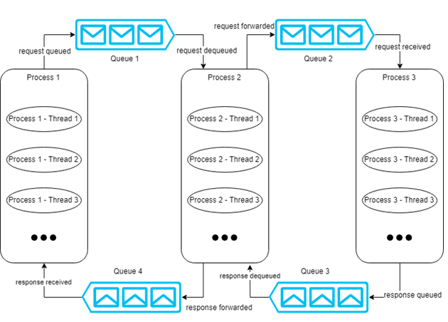

## Shared list of Concurrent Ring Queues benchmark

Simulation of three process roundtrip scenario using ELCRQ.

Shared memory module from [Boost](https://www.boost.org/doc/libs/1_63_0/doc/html/interprocess.html) library.

ELCRQ is a lockless block-when necessary queue based on [LCRQ](http://www.cs.tau.ac.il/~mad/publications/ppopp2013-x86queues.pdf).

The _block-when necessary_ behavior is so that the CPU is free to other things when the queue is empty. The main aim is to save power when the queue is empty. This is implemented using [Event-Count](http://www.1024cores.net/home/lock-free-algorithms/eventcounts)s.

Default simulation runs with 8 threads per process, i.e., 24 threads total, each pinned to different core.
Hence, the processor should have at least 24 cores to run this simulation.

To lower the number of threads per process, modify  `#define NUM_THREAD 8` in `main.cpp` on line 18.

_P.S Work in progress_

### Build instructions
Requires Boost libraries to be installed.

1. Clone repositroy using `git clone https://github.com/r10a/elcrq`
2. cd `elcrq/c++`
3. Build: `cmake . && make`
4. Run `./main`
